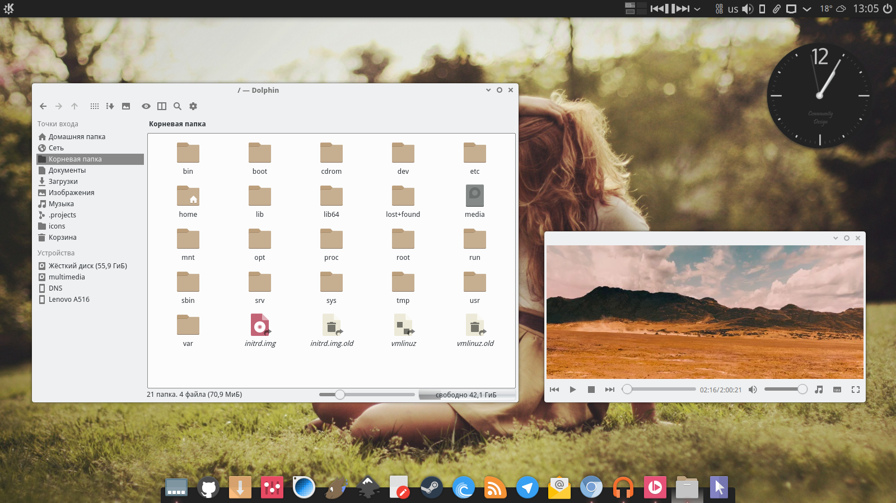

# Papirus pack KDE
Papirus customization for KDE distros.

Icon Theme for Cinnamon and Unity 7 [here](https://github.com/varlesh/papirus-gtk-icon-theme).

On repository avaiable:
* Plasma 5 themes
* Legacy support Plasma themes for KDE 4
* Icons
* Aurorae themes
* System color-schemes
* Konsole profile color-schemes
* Kmail themes (messageviewer)
* GTK themes (only for KDE 5)
* Plank themes (On GTK Theme)
* LibreOffice icons
* Bomi skin (support light and dark colors)
* Yakuake skins

# INSTALL
**For Arch Linux (AUR):**
```
yaourt -S papirus
```
**For Kubuntu 14.04/15.04/15.10:**
```
sudo add-apt-repository ppa:varlesh-l/papirus-pack
sudo apt-get update
#Icon Theme
sudo apt-get install papirus-icon-theme
#Plasma Themes
sudo apt-get install papirus-plasma-theme
#Aurorae Themes
sudo apt-get install papirus-aurorae-theme
#Libreoffice Icon Theme
sudo apt-get install papirus-libreoffice-theme
#GTK-Themes (Only Kubuntu 15.04/15.10)
sudo apt-get install papirus-gtk-theme
#Skins for Yakuake
sudo apt-get install papirus-yakuake-theme
#Konsole/Yakuake color-schemes
sudo apt-get install papirus-konsole-colorscheme
#KMail messageviewer themes
sudo apt-get install papirus-kmail-theme
#Skin for bomi
sudo apt-get install papirus-bomi-theme
```


# LICENSES and AUTHORS
This repository combines many licenses, which mostly come from the original projects. Please, see AUTHOR and LICENSE pages in each module folder of the theme for more information.